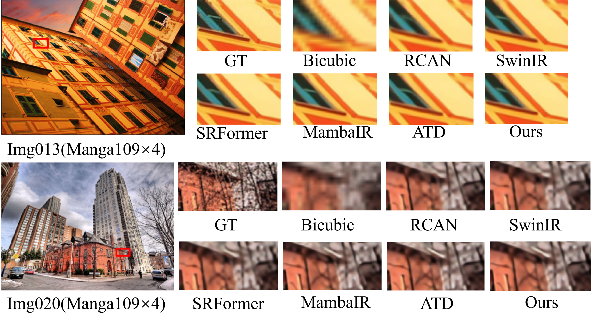

# CADF-Net:Efficient Image Super-Resolution Network Based on Correlated Spatial Attention and Dynamic Fusion

**The official repository with Pytorch**

## Installation

**Clone this repo:**

```bash
git clone git@github.com:ang-plus/CADF-Net.git
cd CADF-Net
```

**Dependencies:**

- PyTorch>1.10
- OpenCV
- Matplotlib 3.3.4
- opencv-python
- pyyaml
- tqdm
- numpy
- torchvision

## Preparation

- Download pretrained models, and copy them to `./train_logs/`:

## Evaluate Pretrained Models

### Example: evaluate the model trained with DIV2K@X4:

- Step 1, the following cmd will report a performance evaluated with python script, and generated images are placed in `./SR`

```
python test.py -v "CADF_X4_DIV2K" -s 1000 -t tester_Matlab --test_dataset_name "Urban100"
```

- Step2, please execute the `Evaluate_PSNR_SSIM.m` script in the root directory to obtain the results reported in the paper. Please modify `Line 8 (Evaluate_PSNR_SSIM.m): methods = {'CADF_X4_DF2K'};` and `Line 10 (Evaluate_PSNR_SSIM.m): dataset = {'Urban100'};` to match the model/dataset name evaluated above.

## Training

- Step1, please download training dataset from [DIV2K](https://data.vision.ee.ethz.ch/cvl/DIV2K/) (`Train Data Track 1 bicubic downscaling x? (LR images)` and `Train Data (HR images)`), then set the dataset root path in `./env/env.json: Line 8: "DIV2K":"TO YOUR DIV2K ROOT PATH"`

- Step2, please download benchmark , and copy them to `./benchmark/`. If you want to generate the benchmark by yourself, please refer to the official repository of [RCAN](https://github.com/yulunzhang/RCAN).

- Step3, training with DIV2K $\times 4$ dataset:

```
python train.py -v "CADF_X4_DIV2K" -p train --train_yaml "train_CADF_X4_DIV2K.yaml"
```

## Visualization




## Note
The code is still being organized and will be continuously updated.
